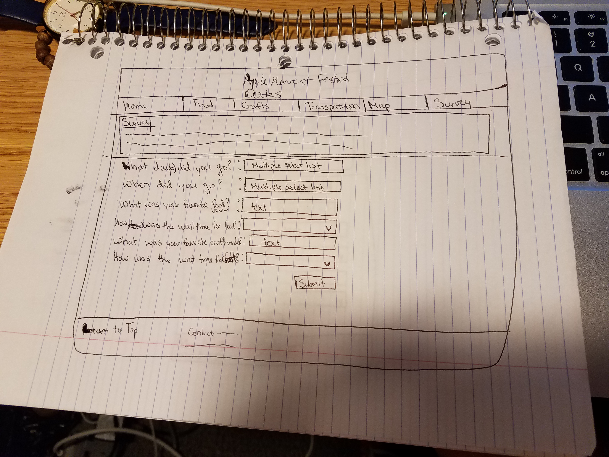
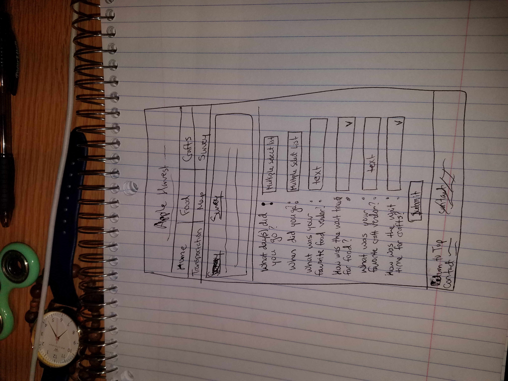
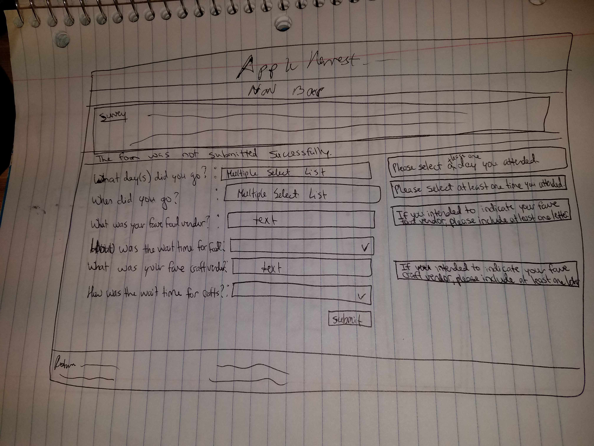
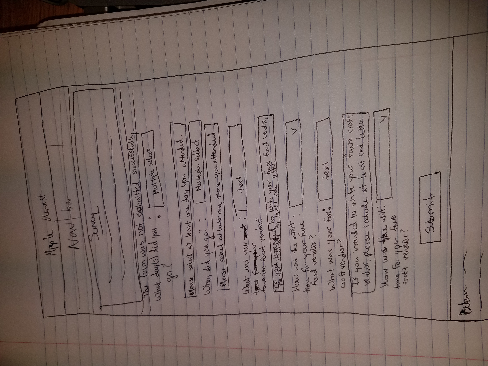
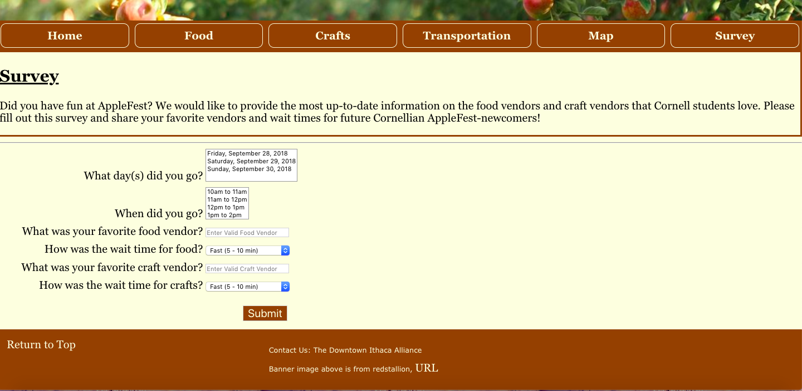
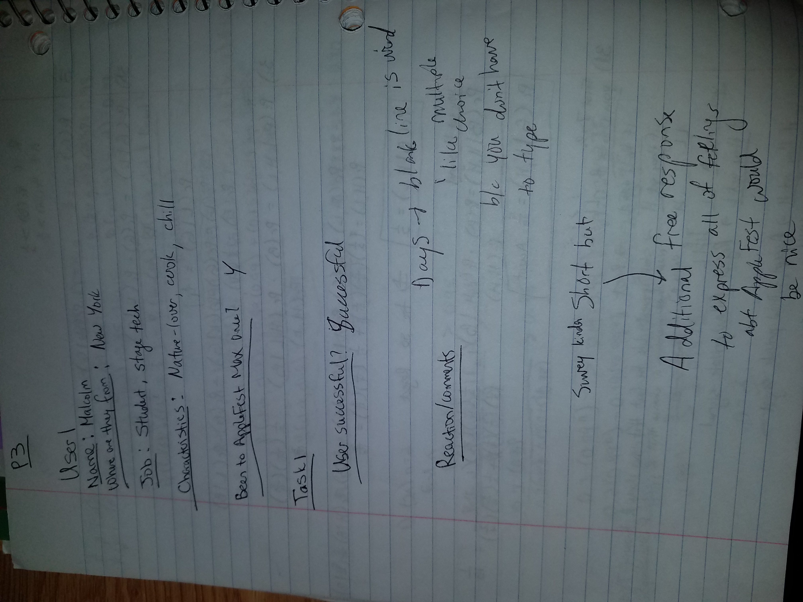
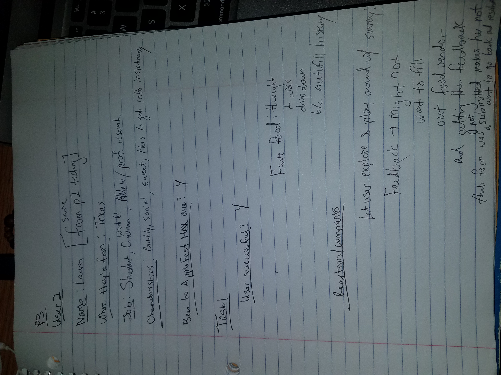
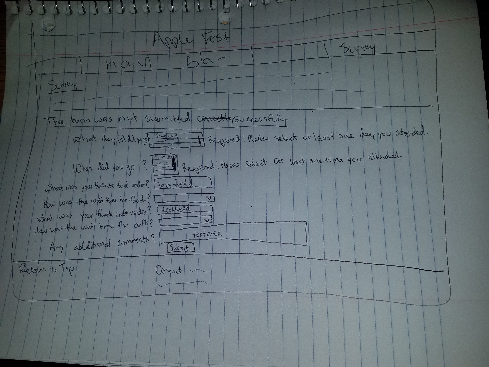
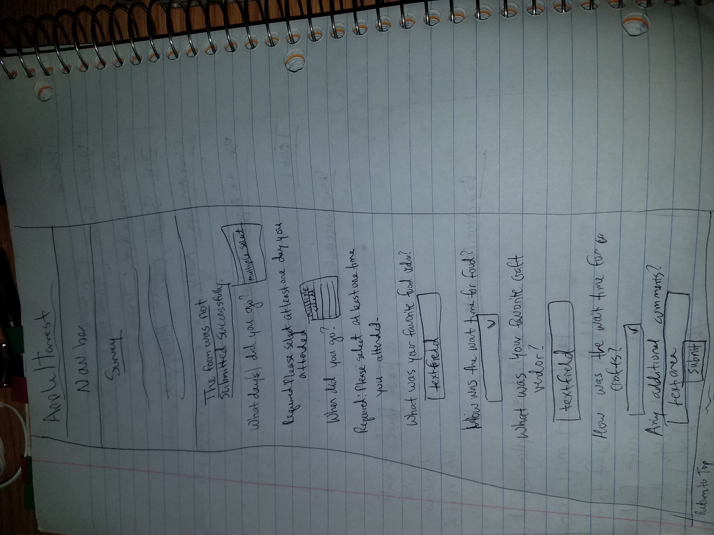

# Project 3 - Design Journey

**For each milestone, complete only the sections that are labeled with that milestone.**

Be clear and concise in your writing. Bullets points are acceptable.

## Milestone 1

## Target Audience (Milestone 1)

My target audience is Cornell students, who have been to AppleFest, AT MOST ONCE. Because Apple Fest is a yearly event, one trip to Apple Fest does not mean that the individual knows everything about the event. Therefore, a Cornell student who never attended is comparable to a Cornell student who briefly attended once prior. Additionally, my target audience are foodies who don't have a lot of time or money to spare because they have prelims to study for and they are on a tight budget. They are going to AppleFest as a way to destress for a little bit before returning to studying.

## Planning & Designing User Input (Milestone 1)
- My form will be a short survey that users can fill out. It will be a separate page called survey.html. Since the survey encompasses multiple parts of AppleFest (and therefore, my website), it wouldn't make sense to have it on the bottom of any of the pages. Also, the survey wouldn't fit on the homepage because the homepage should be kind of like the "entrance" to the experience and the survey is more like a bookend.

- The form's purpose is for the website creator to get a better sense of what the average wait times are for crafts and foods, and of what the popular craft & food vendors are that should be showcased on the website. It would help me, the creator, to include more real-time information about the popular food and craft vendors, so that my users can be more informed while planning a trip to AppleFest.

- I will be using multiple select lists for days & times people attended because they could have attended multiple days. I will use text fields for getting info on their favorite food vendor and craft vendor. A drop-down list will be for the average wait time for food and crafts [will be: "Fast (5 - 10 min)", "Moderate (10 - 15 min)", "Long (15 - 20 min)", and "Very Long (20+ min)"]

- I decided to place the feedback right next to/near the inputs in red with the starter "Required:". By putting feedback to the right of the input in the desktop version, I would utilize the horizontal space for desktop so that the user would read from left to right their input and then the feedback that follows. By putting feedback to the bottom of the input for the mobile version, I would utilize the vertical space - this would follow the user's natural trail of vision on a phone.
- I used the color red, the strong tag, and the phrase: "Required: " to indicate to all users (including those who may have colorblindness or blindness) that their form couldn't be successfully sent. By explicitly saying "Required" in my feedback, I am letting the users know that they have to fill out that specific part of the survey.
- Also, I have a strong underlined red line at the top of the survey that says "The form was not submitted successfully." to let the user know from the very start of the page that the survey encountered an issue.

[Include sketches on your form below. Include sketches of your mobile and desktop versions. Image must show in Atom's Markdown Preview, otherwise 0 points for sketch. (Remember your relative URL should be case sensitive.)]

[What submission method will your form use? GET or POST. Explain your reasoning.]
- My form will use POST because although it does not include any sensitive data, I don't want the form to be sent repeatedly if a user refreshes. Since this form is meant to collect data to gauge the wait times and the popular vendors that should be added to the website, it wouldn't be good if one person's survey was submitted repeatedly, thus muddying the results.

## Determine the Form Validation Criteria (Milestone 1)

[For each control in your form, specify the validation criteria and your reasoning behind the criteria.]

Day(s) Attended: control: Day(s) Select (tag select multiple) required control constraints: at least one option is selected
- Reasoning: In order to gauge which days are busiest or when survey responders usually go, I have to know the days the user attended.

Time(s) Attended: control: Time(s) Select (select multiple tag) required control constraints: at least one option is selected
- Reasoning: Similarly, in order to get a sense of which times are busiest or when survey responders usually go, I have to know the time the user went

Favorite Food Vendor: control: Text (input type="text" tag) optional constraints: if not empty, must have at least one alphabetical letter
- Reasoning: In case the user doesn't remember which food vendor they went to but they remember which craft vendor they went to, want to keep this control optional. However, if the text field is not empty, there must be at least one alphabetical letter so that it is an actual name of a vendor and not just a string of random numbers.
- UPDATE: Made Favorite Food Vendor control REQUIRED. In order to make this survey more informative, I decided to make this control required. Given that the target audience are foodies, it is important to know what food vendors they like and should therefore be showcased on the website. I decided to add in a placeholder "Enter Valid Food Vendor" to encourage them to put in an actual name and not just a string of numbers.

Fave Food Vendor Wait Time: control: drop down list (select tag) optional control constraints: if selecting an option, can only select one
- Reasoning: Optional because the user may not remember which food vendor they went to or they may have a better idea of their favorite craft vendor. Control constraint is from inherent character of the drop down list.
- UPDATE: I decided for this control to be for a general measurement for wait time for food. The specific wait time for one place isn't as far encompassing as the average wait time for food vendors. The target audience will have different tastes and so a more general representation of wait time would be easier and quicker to see. Also, users may not remember exactly how much time they spent waiting for one vendor, so it is better to get their general impression of wait-time. (The same can be said for wait time for crafts.)

Favorite Craft Vendor: control: Text (input type="text" tag) optional constraints: if not empty, must have at least one alphabetical letter
- Reasoning: [Same as Favorite Food Vendor] In case the user doesn't remember which craft vendor they went to but they remember which food vendor they went to, want to keep this control optional. However, if the text field is not empty, there must be at least one alphabetical letter so that it is an actual name of a vendor and not just a string of random numbers.
- UPDATE: Made Favorite Craft Vendor control REQUIRED. In order to make this survey more informative, I decided to make this control required. Similarly with the favorite food vendors, it is important to know what craft vendors the target audience likes and should therefore be showcased on the website. I decided to add in a placeholder "Enter Valid Craft Vendor" to encourage them to put in an actual name and not just a string of numbers.

Fave Craft Vendor Wait Time: control: drop down list (select tag) optional control constraints: if selecting an option, can only select one
- Reasoning: [Same as Fave Food Vendor Wait Time] Optional because the user may not remember which craft vendor they went to or they may have a better idea of their favorite food vendor. Control constraint is from inherent character of the drop down list.
- UPDATE: I decided for this control to be for a general measurement for wait time for crafts. The specific wait time for one place isn't as far encompassing as the average wait time for craft vendors. The target audience will have different tastes and so a more general representation of wait time would be easier and quicker to see.

## Design Form Feedback (Milestone 1)

[Include sketches of your mobile and desktop feedback.]

##  Plan Validation Pseudocode (Milestone 1)

[Write your form validation pseudocode here.]

I used bullets to distinguish indentation

- When form is submitted do:
  - if at least one option in Day(s) Attended multiple select list is not selected:
    - show its Feedback
    - Do not submit Form
  - if at least one option in Time(s) Attended multiple select list is not selected:
    - show its Feedback
    - Do not submit Form
  - if Favorite Food Vendor is not empty and does not have a letter:
    - show its Feedback
    - Do not submit Form
  - if Favorite Craft Vendor is not empty and does not have a letter:
    - show its Feedback
    - Do not submit Form
  - otherwise:
    - submit Form
## Additional Information (Milestone 1)

- UPDATE: Slightly changed format of survey as screen size decreases. Instead of keeping the labels in the same line with the inputs, I had the inputs wrap so that ultimately in the smallest size some of the labels were right above the inputs. This looked better than having the labels and inputs inline because then empty white space was reduced. Also, this would reduce scrolling, making the survey quick and easy for my busy target audience.

- UPDATE: Decided not to put feedback in boxes. Having feedback in boxes next to input boxes made the survey page seem too cluttered. It was confusing as to what was the input box and what the feedback box was.

## Final Submission

### Task Planning (Final Submission)

You took a break from your studying to go to AppleFest on Saturday from 10am to 11am, the least busy time for the event. You stopped by LittleTree Orchards, and after about 5 minutes of waiting, you picked up your pre-ordered donuts. You then went to the craft vendor for Worry Stones, but so many other students were waiting on line for them because they were stressed out about prelims. You finally got your Worry Stone after 30 minutes of waiting on line! The two vendors you stopped by were your ultimate favorites and so their products were worth the wait! To share your experience with your fellow Cornellians, you decide to fill out the following survey.

Screenshot of survey before testing:

### Participant 1 (Final Submission)

1. Who is your participant, e.g., what is their name, where do they comes from, what is their job, characteristics, etc.?
- Name: Malcolm D.
- Year: Sophomore
- Where are they from: New York (not the city)
- Job: Student; stage tech
- Characteristics: Nature-lover, likes to cook, relaxed and open

2. Does your participant belong to your target audience of the site? (Yes / No)
- Yes. He has only been to AppleFest once.

### User Testing for Participant 1 (Final Submission)
[Report the results for your user's performance on each of your tasks. You should **describe the task** you ask the user to complete, explain **what the user did**, describe the user's **reaction/feedback** to the design, **reflect on the user's performance**, determine what **re-design choices** you will make. You can also add any additional comments in the **memo** field.]

Format:
- Task #1
  - **Task Description** (What was the task for this user?)
    - The task arises from the following scenario: You took a break from your studying to go to AppleFest on Saturday from 10am to 11am, the least busy time for the event. You stopped by LittleTree Orchards, and after about 5 minutes of waiting, you picked up your pre-ordered donuts. You then went to the craft vendor for Worry Stones, but so many other students were waiting on line for them because they were stressed out about prelims. You finally got your Worry Stone after 30 minutes of waiting on line! The two vendors you stopped by were your ultimate favorites and so their products were worth the wait! To share your experience with your fellow Cornellians, you decide to fill out the following survey.
  - **How did the user do? Did that meet your expectation?**
    - The user was successful in submitting the form.
    - However, I think my task was too long so he sometimes had to refresh his memory on some of the inputs - like what time he attended (10am - 11am) and the name of the food vendor (he said "Tree place" instead of "LittleTree Orchards").
  - **User’s reaction / feedback to the design** (e.g., specific problems or issues found in the tasks)
    - For daysAttended: He said that the blank line in the multiple select list was weird and confusing because he felt like it meant that he had to type something in there.
      - He liked that the idea of having a multiple select list for the days because he didn't have to type the day in himself.
    - Thought survey was kind of short: He said that he would have liked it if there was an additional free response to express all of his feelings/more detail about his experience at AppleFest.
      - Then by having a free response section, it would "feel like someone will actually read my response" (Malcolm)
  - **Your reflections about the user’s performance to the task**
    - The task could have been simpler.
    - The multiple select list for daysAttended has to be fixed to get rid of the random blank line.
    - I should have a free-response section in my survey.
  - **Re-design choices**
    - Decrease the height of the input for the daysAttended multiple select list to get rid of the extra blank line.
    - Create an optional free-response textarea with no constraints.
  - **Memo** (Justify your decisions; additional notes.)
    - Removing the blank line in the multiple select list for daysAttended: I should modify the input box so that it doesn't misleadingly seem like the blank line is another option in the list or a prompt for the user to type in something.
    - Create textarea for free-response: This control would be optional because not everyone in the target audience would want to spend time to fill out this part of the survey (they are busy students). Getting as much data from them as possible is more important than turning them away from the survey with a required textarea.

[Include evidence that you conducted user testing.]

### Participant 2 (Final Submission)

1. Who is your participant, e.g., what is their name, where do they comes from, what is their job, characteristics, etc.?
- Name: Lauren K [from p2 user testing]
- Year: Sophomore
- Where they are from: Texas
- Job: Student, works at Cornell Cinema, helps prof with research
- Characteristics: Bubbly, social, sweet, uses phone a lot, likes to get info instantaneously

2. Does your participant belong to your target audience of the site? (Yes / No)

- Yes. She attended AppleFest once.

### User Testing for Participant 2 (Final Submission)
[Report the results for your user's performance on each of your tasks. You should **describe the task** you ask the user to complete, explain **what the user did**, describe the user's **reaction/feedback** to the design, **reflect on the user's performance**, determine what **re-design choices** you will make. You can also add any additional comments in the **memo** field.]

Format:
- Task #1
  - **Task Description** (What was the task for this user?)
    - The task arises from the following scenario: You took a break from your studying to go to AppleFest on Saturday from 10am to 11am, the least busy time for the event. You stopped by LittleTree Orchards, and after about 5 minutes of waiting, you picked up your pre-ordered donuts. You then went to the craft vendor for Worry Stones, but so many other students were waiting on line for them because they were stressed out about prelims. You finally got your Worry Stone after 30 minutes of waiting on line! The two vendors you stopped by were your ultimate favorites and so their products were worth the wait! To share your experience with your fellow Cornellians, you decide to fill out the following survey.
  - **How did the user do? Did that meet your expectation?**
    - The user was successful in submitting the form.
    - Interestingly, she thought that the textfield for favorite food was a dropdown because of the autofill history.
  - **User’s reaction / feedback to the design** (e.g., specific problems or issues found in the tasks)
    - User played around with the survey after she successfully completed the task, and when she realized that the favorite food vendor textfield was required (and the feedback popped up), she said that she didn't want to go back to fill out the missing part of the survey.
  - **Your reflections about the user’s performance to the task**
    - Making favorite food vendor (and, by inference, favorite craft vendor) required fields, I could potentially lose users' interest in completing the survey.
      - This would also probably lead to getting only a little data from the few users who completed the survey and missing out on the responses of many other users who simply did not want to go back and complete the favorite food vendor textfield (because maybe in some cases they didn't have a favorite food vendor).
  - **Re-design choices**
    - Return to original plan for the favorite food vendor and favorite craft vendor to make the textfields optional instead of required.
    - Remove feedback for those textfields
    - Keep placeholders
  - **Memo** (Justify your decisions; additional notes.)
    - Making favorite food vendor and favorite craft vendor textfields optional instead of required: The survey should accommodate users who do not want to (or cannot remember) specific names of favorite vendors but do want to indicate the day and time they attended AppleFest.
      - This is fitting because the target audience members are students busy studying for prelims. Many of them would not have the time to think about their favorite vendors.
      - Since these controls will then be optional, the feedback will be removed.
      - However, the placeholders will be maintained in an effort to encourage users to type in valid vendor names if they choose to enter info into this textfield.

[Include evidence that you conducted user testing.]

New sketches resulting from user testing:

### Additional Users...

[If you conduct more user tests of your website, include your tests here. You are not *required* to conduct these additional tests, but you might find them helpful for refining your website.]

### Additional Design Justifications (Final Submission)

[If you feel like you haven’t fully explained your design choices in the final submission, or you want to explain some functions in your site (e.g., if you feel like you make a special design choice which might not meet the final requirement), you can use the additional design justifications to justify your design choices. Remember, this is place for you to justify your design choices which you haven’t covered in the design journey. Use it wisely. However, you don’t need to fill out this section if you think all design choices have been well explained in the final submission design journey.]
